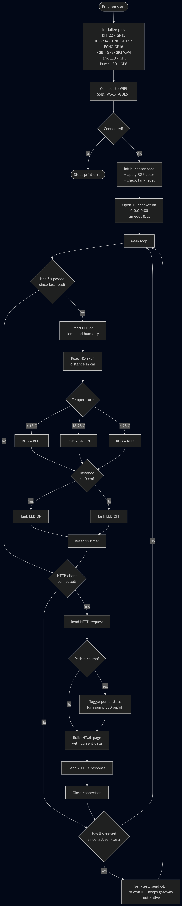
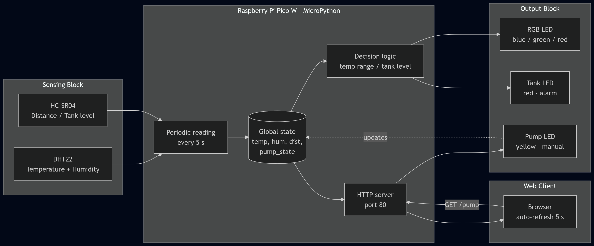

# IoT - Module 4

Projects from the IoT module using a Raspberry Pi Pico W and MicroPython.

Due to a lack of physical hardware (force majeure), everything was done in
Wokwi using the VS Code extension. Each folder has its own `main.py`,
`diagram.json` and `wokwi.toml` ready to run.

## Final project video

https://github.com/migueandres1/IOT4/raw/main/part2/demo.mp4

[View / download the video](part2/demo.mp4)

## Documentation (final project)

### Flowchart



### Block diagram



## Structure

```
part1/   8 guided projects from the module
part2/   final project - IoT tank monitor
```

## Part 1 - Guided projects

1. `01-blink/` - LED blink
2. `02-button-led/` - LED controlled by a push button
3. `03-traffic-light/` - traffic light with 3 LEDs
4. `04-dht22/` - reading temperature and humidity
5. `05-ultrasonic/` - distance with HC-SR04
6. `06-servo-potentiometer/` - SG90 servo with a potentiometer
7. `07-webserver-led-temp/` - web server with LED and DHT22
8. `08-webserver-rgb/` - web server to control an RGB LED

## Part 2 - Final project

Folder `part2/`. Tank monitoring system that:

- measures temperature and humidity with a DHT22
- measures distance with an HC-SR04 (simulating the tank level)
- changes the color of an RGB LED based on the temperature:
  - cold (< 18 C) -> blue
  - moderate (18-28 C) -> green
  - hot (> 28 C) -> red
- turns on a red LED when the tank is nearly empty (< 10 cm)
- exposes a web server with:
  - real-time dashboard with the 3 values (refreshes every 5 s)
  - button to turn the pump on/off (another LED)

---

## How to run them

### Requirements

- VS Code with the Wokwi extension installed
- Active Wokwi Club account (required for simulated WiFi)
- `mpremote` to push the Python code to the simulator:
  ```
  pip install --user mpremote
  ```
- For the WiFi projects (07, 08, part 2): the `wokwigw` binary,
  available at https://github.com/wokwi/wokwigw/releases

### Projects without WiFi (01 to 06)

1. Open the project folder in VS Code
   (e.g. `File > Open Folder > part1/01-blink/`)
2. F1 -> `Wokwi: Start Simulator`
3. In a separate terminal, send the code to the Pico:
   ```
   mpremote connect port:rfc2217://localhost:4000 run main.py
   ```

The extension only loads the firmware. `mpremote` handles uploading and
executing the `main.py` on the Pico's virtual filesystem.

### Projects with WiFi (07, 08, part 2)

In addition to the steps above, you have to start the network gateway so
the web server is reachable from your browser.

1. In one terminal, start `wokwigw`:
   ```
   ~/.local/bin/wokwigw --forward 8080:10.13.37.3:80
   ```
   (leave it running)

2. In VS Code, open the project folder and start the simulator:
   ```
   F1 -> Wokwi: Start Simulator
   ```

3. In another terminal, send the code:
   ```
   mpremote connect port:rfc2217://localhost:4000 run main.py
   ```

4. Wait for the `WiFi OK -> 10.13.37.3` message in the console.

5. Open the dashboard in your browser:
   ```
   http://localhost:8080
   ```

### Important notes

- The `wokwi.toml` is already configured with
  `[net] gateway = "ws://localhost:9011"` so the simulator uses the
  external gateway (`wokwigw`).
- In the 3 WiFi projects, the `main.py` includes an internal client that
  sends a GET request to itself every 8 seconds. This works around a
  limitation in `wokwigw` v2.0.1 (issue #871) where the route to the
  Pico W is lost if there is no traffic. Without this, the browser fails
  to connect.
- The simulator tab in VS Code must remain visible while running (if you
  hide it, the simulator pauses).

---

## Author

Miguel Lopez
